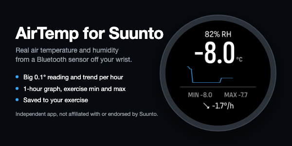
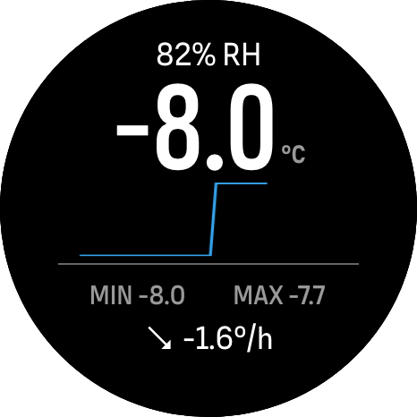
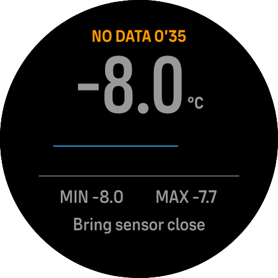
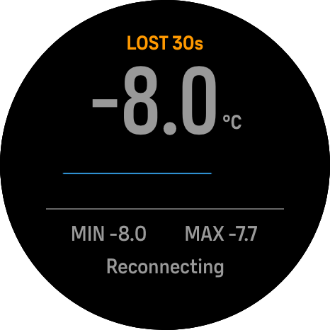

# Suunto AirTemp



_Independent app, not affiliated with or endorsed by Suunto._

SuuntoPlus sports app that shows the **real air temperature and humidity** from a Bluetooth sensor you carry away from your body. The watch's own temperature sensor sits against your wrist and reads several degrees too warm; a small sensor on the outside of your pack does not.

**Status (2026-10-05):** runs on a Suunto Race S (fw 2.53.42) with a Xiaomi LYWSD03MMC (stock firmware): connects, shows live values and logs them. The redesigned screen (v3, with the 1 h graph) and the Auto sensor option are built and tested in the simulator; their watch run is next. Not yet in the SuuntoPlus store. Suunto AirTemp is an independent app, not affiliated with or endorsed by Suunto.

**Author:** O. Vitya

## What it looks like

<table>
  <tr>
    <td width="33%" valign="top"><br/><strong>Live.</strong> Humidity on top, the air value, the last hour as a graph, the exercise's min and max, and the trend (°/h) at the bottom.</td>
    <td width="33%" valign="top"><br/><strong>No data.</strong> The sensor went quiet: an orange word with the time since the last reading, the value greyed, and what to try at the bottom.</td>
    <td width="33%" valign="top"><br/><strong>Lost.</strong> The connection dropped; the app reconnects by itself. After 2 minutes the old value is replaced by "--".</td>
  </tr>
</table>

Simulator screenshots (Race S, 466 px) with demo data; the graph's step is the demo data.

Store images: [banner](store/upload/1-banner-600x300.png) (600×300) and [app image](store/upload/2-app-image-466.png) (466×466); listing text in [store/listing.md](store/listing.md).

## Sensors

Chosen with the app's **Sensor** setting in the Suunto app (a sideloaded build uses the default in `data.json`):

| Setting | Finds | Status |
|---|---|---|
| Auto: Xiaomi or standard sensor (default) | Xiaomi LYWSD03MMC by name, or a sensor advertising the Bluetooth Environmental Sensing service; the data decides which | Xiaomi stock firmware tested on a Race S; standard sensors untested |
| SensorPush HT.w/HTP.xw (beta) | SensorPush service UUID | untested |
| RuuviTag fw 3.x (beta) | Ruuvi manufacturer data | untested |
| Standard ESS sensor (beta) | Environmental Sensing service, incl. legacy 0x2A1F and read polling | untested |

The watch can only read sensors that accept a connection. Broadcast-only hygrometers (Govee, ThermoBeacon, Inkbird) cannot work in a SuuntoPlus app. The optional **Sensor name** setting pins one sensor when several are in range (needed for Xiaomi with pvvx/ATC firmware).

## Layout

| Path | What |
|---|---|
| `src/air_temperature/` | The app (main.js, t.html, profiles `ext1-4.js`, cold code `ext6-15.js`, manifest, settings, strings) |
| `test/run.js` | Unit and behaviour checks (`node test/run.js`) |
| `test/variant.js` | Demo (simulator) and debug (watch trace) builds |
| `test/mem/` | Memory scenarios for sp-mem (`node test/mem/summary.js`) |
| `test/xiaomi_capture.py` | Mac-side Bluetooth capture of a Xiaomi sensor |
| `docs/SPEC.md` | Specification; §22.18 holds the hardware findings and the current design |
| `docs/research/` | Sensor, BLE and store research the spec cites |
| `docs/hw/` | Raw sensor captures |
| `store/` | Store listing and upload files |

Tooling (build, deploy bridge, simulator screenshots, watch log, memory tool) is in the sibling repo [aabbeell/suuntoplus-agentic-dev-env](https://github.com/aabbeell/suuntoplus-agentic-dev-env), expected next to this one.

## Build and test

```bash
node test/run.js
node test/variant.js debug builds/debug sensor=1
```

Deploy `builds/debug` through the bridge (`deploy` tool). Always deploy from that same folder: the watch assigns the app ID per source folder, so another folder installs a second copy.

Developer notes (architecture, watch limits, adding a sensor): [DEVELOPMENT.md](DEVELOPMENT.md).

## Related projects

- [suuntoplus-agentic-dev-env](https://github.com/aabbeell/suuntoplus-agentic-dev-env): command-line and agent tooling for building, deploying and debugging SuuntoPlus apps
- [Suuntopo](https://github.com/aabbeell/suuntopo): climbing topos on the watch, with a [browser topo editor](https://topo-editor.vercel.app)
- [VarioLink](https://github.com/aabbeell/suunto-variolink): paragliding vario display for Bluetooth varios
